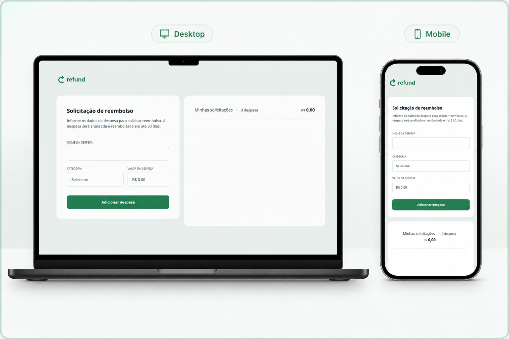

<h1 align="center">
  💸 Refund
</h1>

  <a href="#-o-projeto">O Projeto</a>&nbsp;&nbsp;&nbsp;|&nbsp;&nbsp;&nbsp;
  <a href="#-tecnologias">Tecnologias</a>&nbsp;&nbsp;&nbsp;|&nbsp;&nbsp;&nbsp;
  <a href="#-layout">Layout</a>

  

## 💻 O Projeto

Refund é uma aplicação para solicitação de reembolso de despesas, onde o usuário informa o nome, a categoria e o valor de cada gasto e acompanha em tempo real a lista de solicitações e o total acumulado. O projeto foi desenvolvido durante o módulo de JavaScript intermediário da trilha Full-Stack da Rocketseat.

Os principais destaques do desenvolvimento incluem:

1. **Máscara de moeda em tempo real:** o input de valor captura os dígitos digitados, remove caracteres não numéricos com regex e converte o resultado em centavos antes de formatar no padrão `pt-BR` com `toLocaleString`, simulando o comportamento de um campo de valor monetário.
2. **Criação de elementos via DOM:** cada item da lista de despesas é montado dinamicamente com `createElement` e `append`, em vez de strings de HTML, o que evita problemas de escaping e mantém a estrutura mais previsível.
3. **Delegação de eventos para remoção:** um único listener de clique na `<ul>` trata a remoção de qualquer item da lista (incluindo os adicionados depois), evitando a necessidade de registrar um evento por item.
4. **Recalculo automático dos totais:** a cada despesa adicionada ou removida, o total e a quantidade de itens são recalculados percorrendo a lista e convertendo os valores formatados de volta para número.

## 🚀 Tecnologias

* **HTML5:** Estruturação semântica do formulário com `fieldset`, `legend` e `select`, incluindo validação nativa com atributos `required`.
* **CSS3:** Layout construído com Flexbox, responsividade via media queries e customização da scrollbar da lista de despesas.
* **JavaScript:** Manipulação do DOM, máscara de moeda em tempo real e delegação de eventos para atualização dinâmica da lista e dos totais.
* **Google Fonts:** Fonte Open Sans aplicada em todo o projeto.
* **Figma**
* **Git & GitHub:** Versionamento e deploy da aplicação.

## 🔖 Layout

Você pode visualizar e interagir com o projeto através dos links abaixo:

* 📲 **[Acesse o layout original do projeto aqui](https://www.figma.com/community/file/1360316109107378379)**
* 👉 **[Acesse o site funcionando aqui](https://alissonfa.github.io/refund/)**

**Para rodar no seu computador (Local):**
1. Faça o download ou clone o repositório.
2. Certifique-se de que a estrutura de pastas está correta.
3. Dê um duplo clique no arquivo `index.html` ou abra através da extensão *Live Server* no seu editor de código.

---

Feito com 💜 por **[AlissonFA](https://www.linkedin.com/in/alissonfa/)**